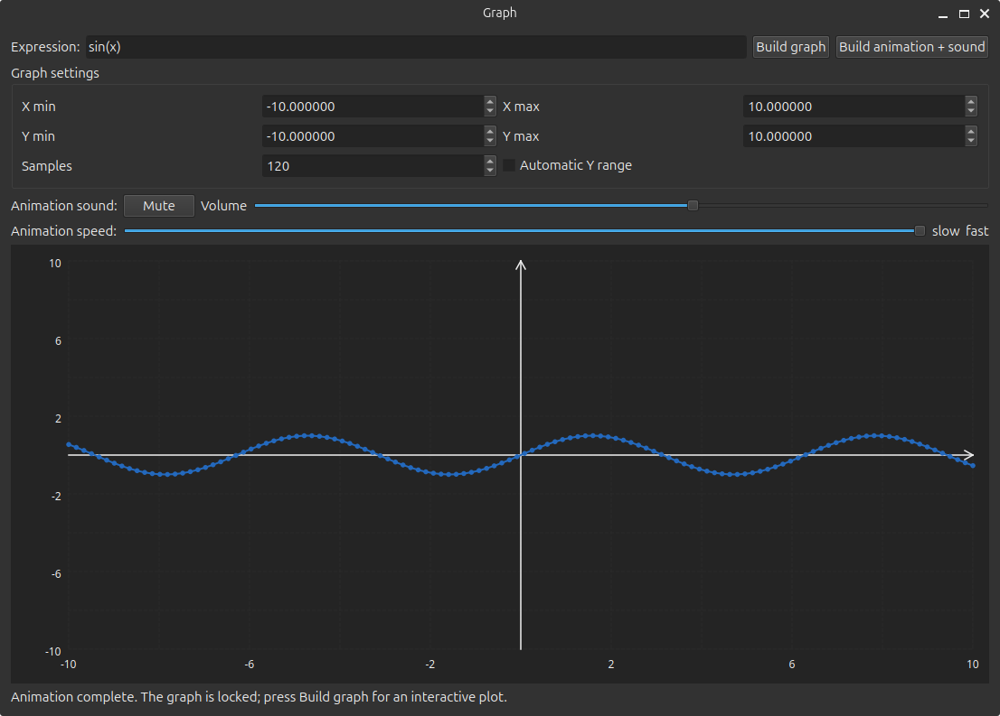

# Graph

Graph is a Linux application for building and exploring mathematical graphs.

The project provides two interfaces:

- `Graph`: a command-line interface with ASCII graph rendering;
- `GraphUi`: a Qt Widgets graphical interface with an interactive plot.



## Features

- Mathematical expression parsing and evaluation;
- CLI ASCII graph rendering;
- Qt Widgets graphical interface;
- Animated graph construction from the minimum X value to the maximum X value;
- Audio visualization based on the absolute value of the current Y coordinate;

## Supported expression syntax

The expression engine supports:

- numbers;
- the variable `x`;
- constants `pi` and `e`;
- binary operators `+`, `-`, `*`, `/`, and `^`;
- unary plus and minus;
- parentheses;
- implicit multiplication;
- functions `sin`, `cos`, `tg`, `ctg`, and `sqrt`.

## Graphical interface

The GUI allows the user to configure:

- the expression;
- minimum and maximum X values;
- minimum and maximum Y values;
- the number of samples;
- automatic Y range selection;
- animation speed;
- audio volume and mute state.

The regular graph-building mode remains interactive. The graph can be zoomed with the mouse wheel and moved with the left mouse button.

The `Build animation + sound` mode renders the graph from left to right. During the animation and after it finishes, the plot is locked. Pressing `Build graph` creates an interactive graph again.

The animation pitch is calculated from the absolute value of the current Y coordinate. The minimum absolute Y value produces the lowest pitch, while the maximum absolute Y value in the plotted data produces the highest pitch.

## Command-line interface

### Usage

```text
Graph ["expression"] [options]
```

The expression may be supplied as the first positional argument or read from standard input. The `--interactive` mode reads and renders expressions until EOF.

### Options

| Option | Description |
|---|---|
| `--x-min VALUE`, `-f VALUE` | Set the minimum X value. Default: `-10`. |
| `--x-max VALUE`, `-t VALUE` | Set the maximum X value. Default: `10`. |
| `--from VALUE` | Alias for `--x-min`. |
| `--to VALUE` | Alias for `--x-max`. |
| `--points COUNT`, `-p COUNT` | Set the number of samples. Default: `80`. Valid range: `2`–`4096`. |
| `--width COUNT`, `-W COUNT` | Set the ASCII plot width. Default: `80`. Valid range: `20`–`240`. |
| `--height COUNT`, `-H COUNT` | Set the ASCII plot height. Default: `24`. Valid range: `5`–`100`. |
| `--y-min VALUE` | Set the minimum Y value. Default: `-10`. |
| `--y-max VALUE` | Set the maximum Y value. Default: `10`. |
| `--auto-y`, `-a` | Select the Y range automatically from finite sample values. |
| `--no-axes`, `-n` | Disable coordinate axes. |
| `--no-labels`, `-l` | Disable numeric axis labels. |
| `--no-connect` | Render points without connecting line segments. |
| `--jump-factor VALUE` | Set discontinuity jump sensitivity. Default: `0.75`. |
| `--curve-symbol C` | Set the curve character. Default: `*`. |
| `--x-axis-symbol C` | Set the X-axis character. Default: `-`. |
| `--y-axis-symbol C` | Set the Y-axis character. Default: `\|`. |
| `--origin-symbol C` | Set the axes intersection character. Default: `+`. |
| `--output FILE`, `-o FILE` | Write the rendered graph to a file. |
| `--interactive`, `-i` | Read and render expressions until EOF. |
| `--help`, `-h` | Display the CLI help message. |

## Building from source

### Requirements

- Linux;
- a C++20 compiler;
- CMake 3.20 or newer;
- Qt 6 Widgets;
- Qt 6 Multimedia for animation sound;
- Git;
- standard build tools.

On Debian or Ubuntu, install the dependencies with:

```bash
sudo apt update
sudo apt install build-essential cmake qt6-base-dev qt6-multimedia-dev git
```

### Configure and build

```bash
cmake -S . -B build -DCMAKE_BUILD_TYPE=Release
cmake --build build -j$(nproc)
```

The build produces:

- `build/Graph`;
- `build/GraphUi`;
- `build/GraphTests`.

## AppImage

AppImage is the recommended distribution format for users who do not want to install the project from source. The resulting file can be downloaded, marked as executable, and started without a separate Graph installation.

### Install an AppImage

```bash
chmod +x Graph-x86_64.AppImage
./Graph-x86_64.AppImage
```
